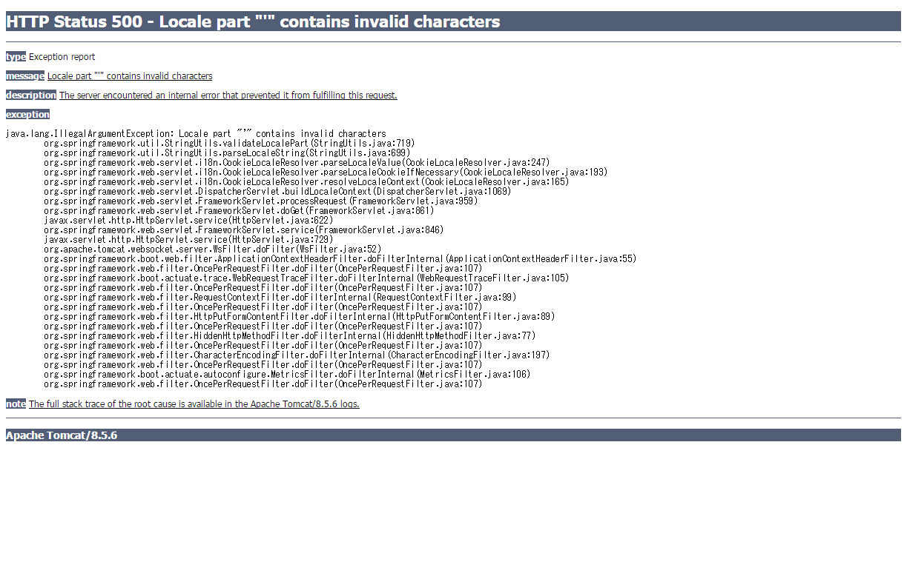

# Demo Application for reproducing "CookieResolver" Failure

## What is occurred?
- "Tomcat default stacktrace page" wll be displayed when invalid locale value is input

Here is screenshot

## How to reproduce
1. run application
1. access [http://localhost:8080/index](http://localhost:8080/index)
1. modify cookie "locale" into invalid character(e.g. `'`)
1. reload
1. you will get stacktrace

## How about other error situations?
### 404 Not Found
1. run application
1. access [http://localhost:8080/hoge](http://localhost:8080/hoge)
1. you will get default error page (template in `templates/error.html`)

### Exception in Controller
1. run application
1. access [http://localhost:8080/exception](http://localhost:8080/exception)
1. you will get "Internal Server Error" page (template of `templates/500.html`)